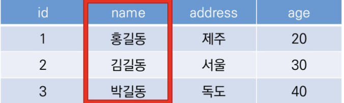
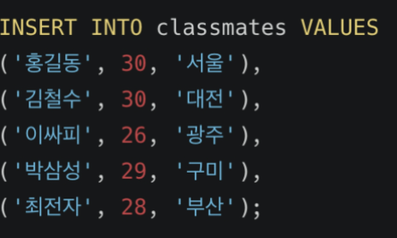

# DB 01


# Database

## 데이터베이스 (DB)

- 데이터베이스는 **체계화된 데이터**의 모임
- 여러 사람이 공유하고 사용할 목적으로 통합 관리되는 정보의 집합
- 논리적으로 연관된 (하나 이상의) 자료의 모음으로 그 내용을 고도로 구조화 함으로써 검색과 갱신의 효율화를 꾀한 것

- 즉, 몇 개의 자료 파일을 조직적으로 통합하여 자료 항목의 중복을 없애고 자료를 구조화하여 기억시켜 놓은 자료의 집합체

## 데이터베이스로 얻는 장점들

- 데이터 중복 최소화
- 데이터 무결성(정확한 정보를 보장)
- 데이터 일관성
- 데이터 독립성(물리적/논리적)
- 데이터 표준화 
- 데이터 보안 유지

# RDB

## 관계형 데이터 베이스(RDB)

- Relational Database
- 키(key)와 값(value)l들의 간단한 관계를 표 형태로 정리한 데이터베이스 
- 스키마 : 데이터베이스에서 자료의 구조, 표현방법, 관계 등 전반적인 명세를 기술 한 것
- 테이블: 열(컬럼/필드)과 행(레코드/값)의 모델을 사용해 조작된 데이터 요소들의 집합
- 열: 각 열에는 고유한 데이터 형식이 지정됨
- 
- 행: 실제 데이터가 저장되는 형태 
- 

# RDBMS

## 관계형 데이터베이스 관리 시스템 (RDBMS)

- 관계형 모델을 기반으로 하는 데이터베이스 관리 시스템을 의미

# SQL

## SQL (Structured Query Language)

- 관계형 데이터베이스 관리 시스템의 데이터 관리를 위해 설계된 특수 목적 프로그램이 언어
- 데이터베이스 스키마 생성 및 수정
- 자료의 검색 및 관리 
- 데이터베이스 객체 접근 조정 관리

## SQL 분류


- INSERT = 새로운 데이터 삽입(추가)
- SELECT = 저장되어있는 데이터 조회
- UPDATE = 저장되어있는 데이터 갱신
- DELETE = 저장되어있는 데이터 삭제

# 테이블 생성 및 삭제

## CSV파일을 Table로 만들기


## SELECT

```sql
SELECT * FROM examples;
```

## 테이블 생성 및 삭제 statement

- CREATE TABLE
    - 데이터베이스에서 테이블 생성
- DROP TABLE
    - 데이터베이스에서 테이블 제거

## CREATE

```sqlite
CREATE TABLE classmates (
id INTEGER PRIMARY KEY,
name TEXT
);
.tables
>>> classmates examples
테이블이 생성됨..
```

CREATE는 테이블을 생성한다.

## 특정 테이블의 schema 조회

```sqlite
.schema classmates
>
CREATE TABLE classmates (
id INTEGER PRIMARY KEY,
name TEXT
);

```

## DROP

```sqlite
DROP TABLE classmates;
.tables
example
```

DROP은 테이블을 삭제한다.

## 테이블 생성 실습

- 다음과 같은 스키마를 가지고 있는 classmates 테이블을 만들고 스키마를 확인해보세요

    


```sqlite
CREATE TABLE classmates(
name = TEXT,
age = INT,
address = TEXT
);
```

# CRUD

# CREATE

## CREATE

- INSERT
    - insert a single row into a table
    - 테이블에 단일 행 삽입

```sqlite
INSERT INTO 테이블이름 (컬럼1, 컬럼2, ... ) VALUES(값1, 값2, ...);
```

INSERT는 특정 테이블에 레코드(행)를 삽입(생성)!

```sqlite
INSERT INTO classmates(name, age) VALUES ('홍길동', 23);
```

Q. classmates 테이블에 이름이 홍길동이고 나이가 30이고 주소가 서울인 데이터를 넣어봅시다. 

```sqlite
INSERT INTO classmates VALUES('홍길동', 30, '서울');
```

모든 열에 데이터가 있는 경우에는 column을 명시하지 않아도 된다. 

? id는 어디갔을까?

SQLITE가 관리하고 있다.

SQLITE는 따로 PRIMARY KEY 속성의 컬럼을 작성하지 않으면 값이 자동으로 증가하는 PK옵션을 가진 

rowid컬럼을 정의


## 비어있는 1호 홍길동 씨의 주소

주소가 꼭 필요한 정보라면 공백으로 비워두면 안된다. (NOT NULL 설정 필요)

## 지우고 새로 만들기

```sqlite
DROP TABLE classmates;
CREATE TABLE classmates (
id INTEGER PRIMARY KEY,
name TEXT NOT NULL,
age INT NOT NULL,
address TEXT NOT NULL
);
```

## 다시 INSERT 사용해보기


```sqlite
INSERT INTO classmates VALUES(1, '홍길동', 30, '서울');
```

1. id를 포함한 모든 value를 작성

```sqlite
INSERT INTO classmates (name, age, address) VALUES('홍길동', 30, '서울');
```

2. 각 value에 맞는 column들을 명시적으로 작성





# READ

## SELECT statement

- SELECT
    - query data from a table
    - 테이블에서 데이터를 조회
    - SELECT 문은 SQLite에서 가장 복잡한 문이며 다양한 절(clause)와 함꼐 사용
        - ORDER BY, DISTINCT, WHERE, LIMIT, GROUP BY

## SELECT와 함꼐 사용하는 clause

- LIMIT
    - 쿼리에서 반환되는 행 수를 제한
    - 특정 행부터 시작해서 조회하기 위해 OFFSET 키워드와 함께 사용하기도 함
- WHERE
    - 쿼리에서 반환된 행에 대한 특정 검색 조건을 지정

- SELECT DISTINCT
    - 조회 결과에서 중복 행을 제거
    - DISTINCT 절은 SELECT 키워드 바로 뒤에 작성해야 함.

## SELECT statement

```SQLite
SELECT 컬럼1, 컬럼2, ... FROM 테이블 이름;
```

모든 컬럼 값이 아닌 특정 컬럼만 조회하기

Q. classmates 테이블에서 id, name 컬럼 값만 조회하세요.

```sqlite
SELECT rowid, name FROM classmates;
```


## LIMIT

```sqlite
SELECT 컬럼1, 컬럼2, ... FROM 테이블이름 LIMIT 숫자;
```

원하는 수 만큼 데이터 조회하기

Q. classmates 테이블에서 id, name 컬럼 값을 하나만 조회하세요.

```sqlite
SELECT rowid, name FROM classmates LIMIT 1;
```


## OFFSET keyword

```sqlite
SELECT 컬럼1, 컬럼2, ... FROM 테이블이름 LIMIT 숫자 OFFSET 숫자;
```

특정 부분에서 원하는 수 만큼 데이터 조회하기.

Q. classmates 테이블에서 id, name 컬럼 값을 세 번째에 있는 하나만 조회하세요.

```sqlite
SELECT rowid, name FROM classmates LIMIT 1 OFFSET 2;
```


## OFFSET

- 동일 오브젝트 안에서 오브젝트 처음부터 주어진 요소나 지점 까지의 변위차(위치 변화량)을 나타내는 정수형
- 예시
    - 1. 문자열 'abcedf'에서 문자 c는 시작점 a에서 2의 OFFSET을 지님
        2. SELECT * FROM MY_TABLE LIMIT 10 OFFSET 5
            - 6번째 행부터 10개의 행을 조회 (6번째 행부터 10개를 출력)
            - 0부터 시작함.

## WHERE 

```sqlite
SELECT 컬럼1, 컬럼2, ... FROM 테이블이름 WHERE 조건;
```

특정데이터(조건) 조회하기

Q. classmates 테이블에서 id, name 컬럼 값 중에서 주소가 서울인 경우의 데이터를 조회하세요.

```sqlite
SELECT rowid, name FROM classmates WHERE address = '서울';
```

## DISTINCT

```sqlite
SELECT DISTINCT 컬럼 FROM 테이블이름;
```

특정 컬럼을 기준으로 중복없이 가져오기.

Q. classmates 테이블에서 age 값 전체를 중복없이 조회하세요.

```sqlite
SELECT DISTINCT age FROM classmates
```

# DELETE

- DELETE
    - 테이블에서 행을 제거

```sqlite
DELETE FROM 테이블 이름 WHERE 조건;
```

조건을 통해 특정 레코드 삭제하기


Q. classmates 테이블에 id가 5인 레코드를 삭제하세요.

```sqlite
DELETE FROM classmates WHERE rowid=5;
```

## AUTOINCREMENT

- column attribute
- SQLite가 사용되지 않은 값이나 이전에 삭제된 행의 값을 재사용하는 것을 방지


# UPDATE

## UPDATE statement

- UPDATE
- 기존 행의 데이터를 수정
- SET clause에서 테이블의 각 열에 대해 새로운 값을 설정

```sqlite
UPDATE 테이블이름 SET 컬럼1=값1, 컬럼2=값2 ... WHERE 조건;
```

조건을 통해 특정 레코드 수정하기.

중복 불가능한(UNIQUE)값인 rowid를 기준으로 수정하자!

Q. classmates 테이블에 id가 5인 레코드를 수정하세요 이름을 홍길동으로 주소를 제주도로 바꿔주세요.

```sqlite
UPDATE classmates SET name="홍길동", address='제주도' WHERE rowid=5;
```


# WHERE


## WHERE 복습

```sqlite
SELECT * FROM 테이블 이름 WHERE 조건;
```

특정 조건으로 데이터 조회하기

Q. users테이블에서 age가 30이상인 유저의 모든 컬럼 정보를 조회하려면?

```sqlite
SELECT * FROM users WHERE age >= 30;
```


```sqlite
SELECT first_name FROM users WHERE age >= 30;
```


```sqlite
SELECT age, last_name FROM users WHERE age>=30 AND last_name='김';
```

# SQLite Aggregate Functions

## Aggregate function

- 집계 함수
- 값 집합에 대한 계산을 수행하고 단일 값을 반환
    - 여러 행으로부터 하나의 결괏값을 반환하는 함수
- SELECT 구문에서만 사용됨
- 예시
    - 테이블 전체 행 수를 구하는 COUNT(*)
    - age컬럼 전체 평균 값을 구하는 AVG(age)


## OverView of SQLite aggregate functions

- COUNT
    - 그룹의 항목 수를 가져옴
- AVG
    - 모든 값의 평균을 계산
- MAX
    - 그룹에 있는 모든 값의 최대값을 가져옴
- MIN
    - 그룹에 있는 모든 값의 최소값을 가져옴
- SUM
    - 모든 값의 합을 계산

## COUNT

```sqlite
SELECT COUNT(컬럼) FROM 테이블이름;
```

레코드의 개수 조회하기


```sqlite
SELECT COUNT(*) FROM users;
```

## AVG, SUM, MIN, MAX

```sqlite
SELECT AVG(컬럼) FROM 테이블이름;
SELECT SUM(컬럼) FROM 테이블이름;
SELECT MIN(컬럼) FROM 테이블이름;
SELECT MAX(컬럼) FROM 테이블이름;
```

위 함수들은 기본적으로 해당 컬럼이 숫자 INTEGER일 때만 사용 가능


```sqlite
SELECT AVG(age) FROM users WHERE age >= 30;
```


```sqlite
SELECT first_name, MAX(balance) FROM users;
```


```sqlite
SELECT AVG(balance) FROM users WHERE age >= 30;
```

# LIKE

## LIKE operator

- 패턴 일치를 기반으로 데이터를 조회하는 방법
- SQLite는 패턴 구성을 위한 2개의 wildcards를 제공
    - %(percent sign)
        - 0개 이상의 문자
    - _ (underscore)
        - 임의의 단일문자

## LIKE statement

```sqlite
SELECT * FROM 테이블 WHERE 컬럼 LIKE '와일드카드 패턴'
```

패턴을 확인하여 해당하는 값을 조회하기

## wildcards

와일드카드 2가지 패턴


```sqlite
SELECT * FROM users WHERE age LIKE '2_';
```


```sqlite
SELECT * FROM users WHERE phone LIKE '02-%';
```


```sqlite
SELECT * FROM users WHERE first_name LIKE '%준';
```


```sqlite
SELECT * FROM users WHERE phone LIKE '%-5114-%'
```

# ORDER BY

## ORDER BY clause

- ORDER BY
    - 조회 결과 집합을 정렬
    - SELECT 문에 추가하여 사용
    - 정렬 순서를 위한 2개의 keyword 제공
        - ASC - 오름차순 (default)
        - DESC - 내림차순

```sqlite
SELECT * FROM 테이블 ORDER BY 컬럼 ASC;
SELECT * FROM 테이블 ORDER BY 컬럼1, 컬럼2 DESC;
```

특정 컬럼을 기준으로 데이터를 정렬해서 조회하기


```sqlite
SELECT * FROM users ORDER BY age ASC LIMIT 10;
```


```sqlite
SELECT * FROM users ORDER BY age, last_name ASC LIMIT 10;
```


```sqlite
SELECT last_name, first_name FROM users ORDER BY balance DESC LIMIT 10;
```

# GROUP BY

- GROUP BY
    - 행 집합에서 요약 행 집합을 만듦
    - SELECT 문의 optional 절
    - 선택된 행 그룹을 하나 이상의 열 값으로 요약 행으로 만듦
    - 문장에 WHERE 절이 포함된 경우 반드시 WHERE 절 뒤에 작성해야 함


```sqlite
SELECT last_name, COUNT(*) AS name_count FROM users GROUP BY last_name;
```

# ALTER TABLE


- ALTER TABLE 의 3가지 기능

    1. Table 이름 변경

    2. 테이블에 새로운 column 추가 

    3. column 이름 수정

        ```sqlite
        ALTER TABLE table_name
        RENAME COLUMN current_name TO new_name;
        ```

        

방금 만든 테이블의 이름을 변경해보자

```sqlite
ALTER TABLE 기존 테이블 이름 RENAME TO 새로운 테이블 이름;
ALTER TABLE articles RENAME TO news;
```

방금 만든 테이블에 새로운 컬럼을 추가해보자.

```sqlite
ALTER TABLE 테이블 이름 ADD COLUMN 컬럼이름 데이터타입 설정;
ALTER TABLE news ADD COLUMN created_at TEXT NOT NULL;
```


