# DB02

# Model Relationship 1

# Foreign Key

## Foreign Key 개념

- 외래 키 (외부 키)
- 관계형 데이터베이스에서 한 테이블의 필드 중 다른 테이블의 행을 식별할 수 있는 키
- 참조하는 테이블에서 속성(필드)에 해당하고, 이는 참조되는 테이블의 기본 키 (Primary Key)를 가리킴
- 참조하는 테이블의 외래 키는 참조되는 테이블 행 1개에 대응됨
    - 이 때문에 참조하는 테이블에서 참조되는 테이블의 존재하지 않는 행을 참조할 수 없음.
- 참조하는 테이블의 행 여러 개가 참조되는 테이블의 동일한 행을 참조할 수 있음.

## Foreign Key 예시

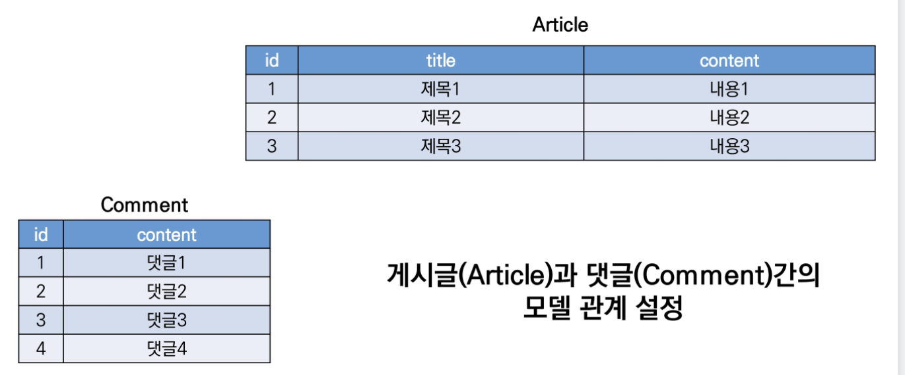

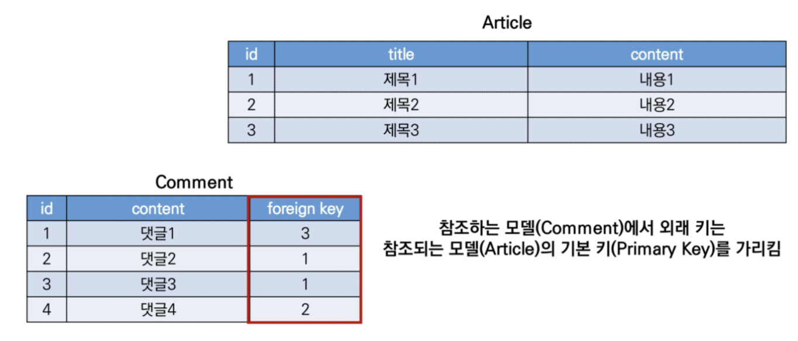

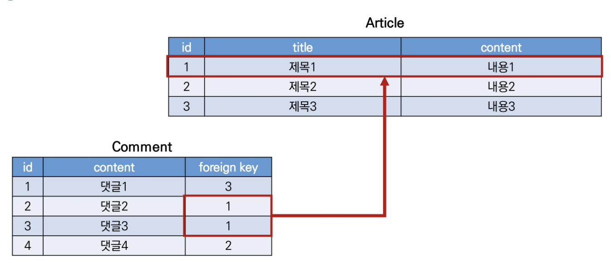

## Foreign Key 특징

- 키를 사용하여 부모 테이블의 유일한 값을 참조 (참조 무결성)
- 외래 키의 값이 반드시 부모 테이블의 기본 키일 필요는 없지만 유일한 값이어야 함


- [참고] 참조 무결성
    - 데이터베이스 관계 모델에서 관련된 2개의 테이블 간의 일관성을 말함
    - 외래 키가 선언도니 테이블의 외래 키 속성(열)의 값은 그 테이블의 부모가 되는 테이블의 기본 키 값으로 존재해야 함.

## ForeignKey field

- 2개의 위치 인자가 반드시 필요
    1. 참조하는 model class
    2. on_delete 옵션
- migrate 작업 시 필드 이름에 _id를 추가하여 데이터베이스 열 이름을 만듦

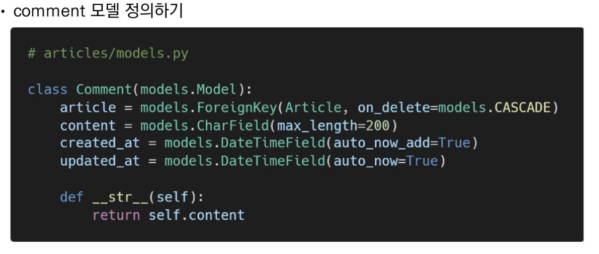

## ForeignKey arguments - 'on_delete'

- 외래 키가 참조하는 객체가 사라졌을 때 외래 키를 가진 객체를 어떻게 처리할 지를 정의
- Database Integrity(데이터 무결성)을 위해서 매우 중요한 설정
- on_delete 옵션에 사용 가능한 값들 
    - CASCADE : 부모객체(참조 된 객체)가 삭제 됐을 때 이를 참조하는 객체도 삭제

## [참고] 데이터 무결성

- 데이터의 정확성과 일관성을 유지하고 보증하는 것을 가리키며, 데이터베이스나 RDBMS 시스템의 중요한 기능임.
- 무결성 제한의 유형
    1. 개체 무결성(Entity integrity)
        - PK의 개념과 관련
        - 모든 테이블이 PK를 가져야 하며 PK로 선택된 열은 고유한 값이어야 하고 빈 값은 허용치 않음을 규정
    2. 참조 무결성(Referential integrity)
        - FK(외래 키) 개념과 관련
        - FK 값이 데이터베이스의 특정 테이블의 PK값을 참조하는 것
    3. 범위(도메인) 무결성(Domain integrity)
        - 정의된 형식 (범위) 에서 관계형 데이터베이스의 모든 컬럼이 선언되도록 규정

## 데이터베이스의 ForeignKeyField 표현

- 만약 ForeignKey 인스턴스를 abcd로 생성했다면 abcd_id로 만들어짐
- 하지만 명시적인 모델 관계 파악을 위해 참조하는 클래스 이름의 소문자(단수형)로 작성하는 것이 바람직함 (1:N) 

## 댓글 생성 시도

```python
comment = Comment()
comment.content = 'first comment'
comment.save()
```

에러가 발생하게 된다.

- 에러확인 
    - articles_comment 테이블의 ForeignKeyField, article_id 값이 누락되었기 때문

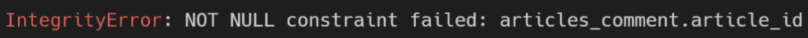

- 게시글 생성 후 댓글 생성 재시도

    ```python
    article = Article.objects.create(title='title', content='content')
    article = Article.objects.get(pk=1)
    comment.article = article
    comment.save()
    
    ```

    

- 댓글 속성 값 확인

    - 실제로 작성된 외래 키 컬럼명은 article_id이기 때문에 article_pk로는 값에 접근할 수 없음.

        

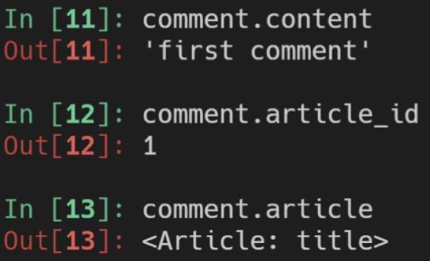

- comment 인스턴스를 통한 article 값 접근

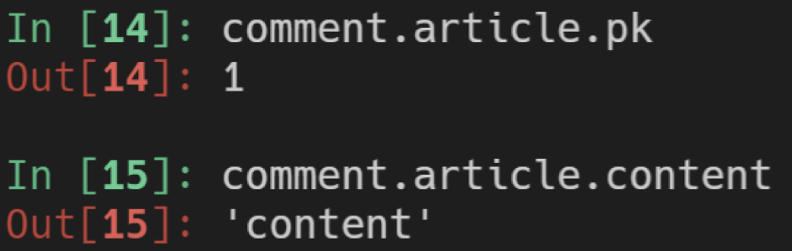

- 두번째 댓글 작성 해보기

    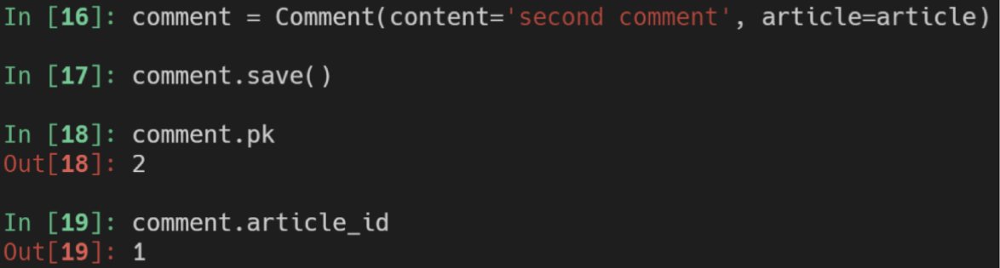

## admin site에서 작성된 댓글 확인 

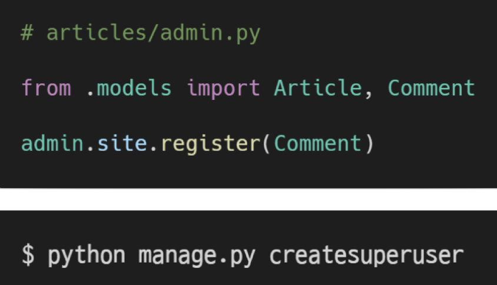

## 1:N 관계 related manager

- 역참조 ('comment_set')
    - Article(1) - Comment(N)
    - article . comment 형태로는 사용할 수 없고, article.comment_set manager가 생성됨
    - 게시글에 몇개의 댓글이 작성되었는지 Django ORM이 보장할 수 없기 때문
        - article은 comment가 있을 수도 있고, 없을 수도 있음
        - 실제로 Article클래스에는 Comment 와의 어떠한 관계도 작성되어 있지 않음
- 참조 ('article')
    - Comment(N) - Article(1)
    - 댓글의 경우 어떠한 댓글이든 반드시 자신이 참조하고 있는 게시글이 있으므로,
    - comment.article 과 같이 접근할 수 있음.
    - 실제 ForeignKeyField 또한 Comment 클래스에서 작성됨.


## 1:N related manager 연습하기

- article 의 입장에서 모든 댓글 조회하기(역참조, 1->N)

    ```python
    article.comment_set.all()
    # 조회한 모든 댓글 출력하기
    comments= article.comment_set.all()
    for comment in comments:
        print(comment.content)
    >>first comment
    >>second comment
    ```

- comment의 입장에서 참조하는 게시글 조회하기 (참조, N->1)

    ```python
    comment = Comment.objects.get(pk=1)
    comment.article
    >> <Article: title>
    comment.article.content
    'content'
    comment.article_id
    1
    ```

    

## ForeignKey arguments - 'related_name'

- 역참조시 사용할 이름 ('model_set' manager)을 변경할 수 있는 옵션
- 

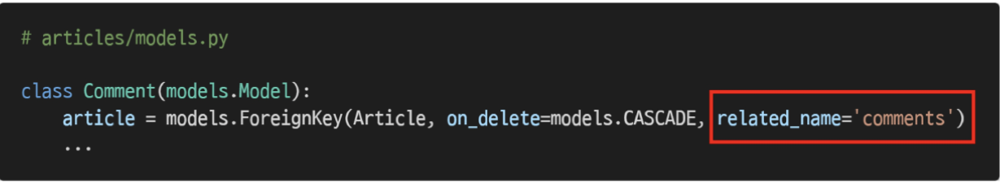

- 위와 같이 변경하면 article.comment_set은 더이상 사용할 수 없고, article.comments로 대체됨
- [주의] 역참조시 사용할 이름 수정 후, migration 과정 필요

# Comment CREATE

## CommentForm 작성

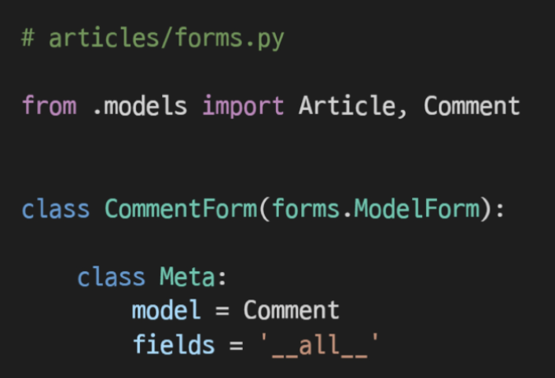

## detail 페이지에서 CommentForm 출력

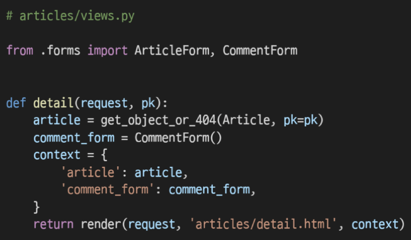

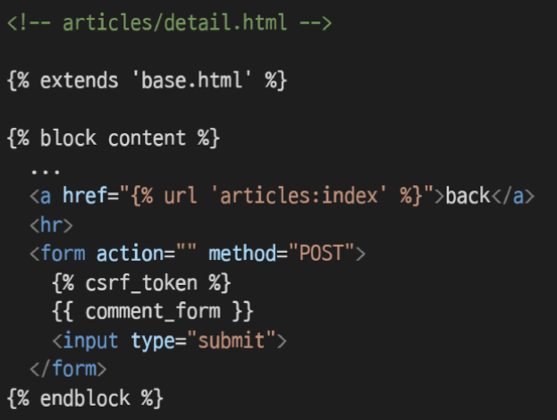

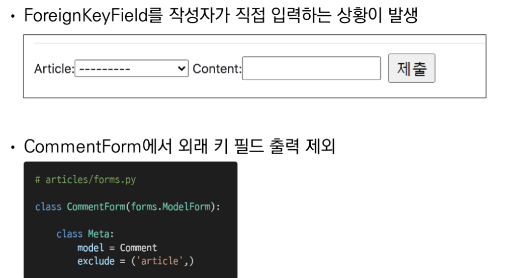

## 댓글 작성 로직

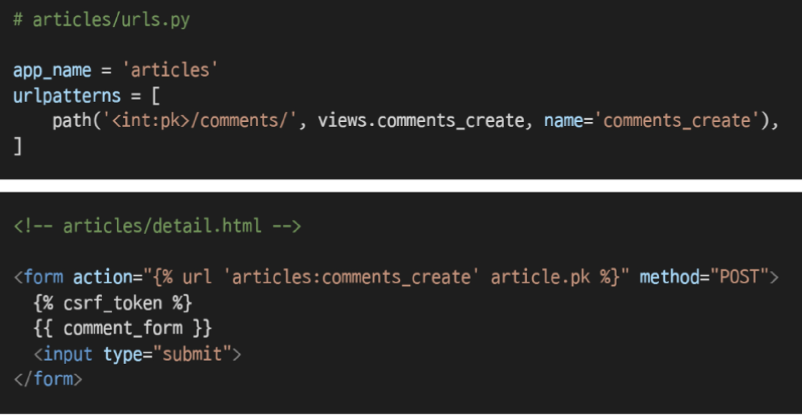

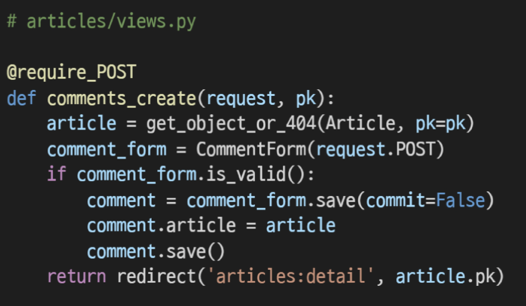

## The 'save()' method 

- save(commit = False)
    - Create, but don't save the new instance.
    - 아직 데이터베이스에 저장되지 않은 인스턴스를 반환
    - 저장하기 전에 객체에 대한 사용자 지정 처리를 수행할 때 유용하게 사용

# Comment READ

## 댓글 출력

- 특정 article에 있는 모든 댓글을 가져온 후 context에 추가

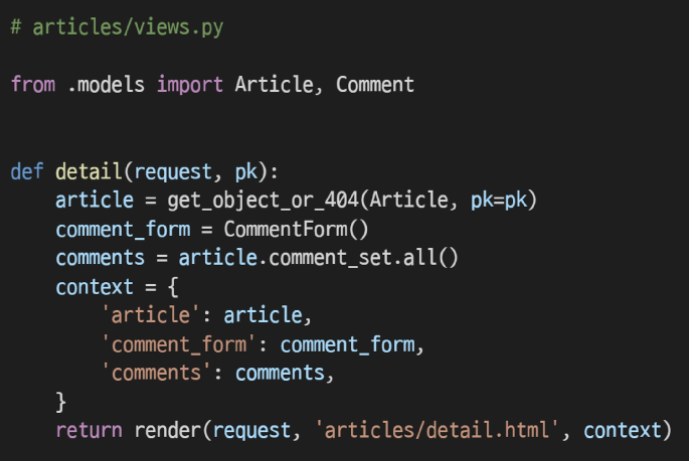

- detail 페이지에서 댓글 출력

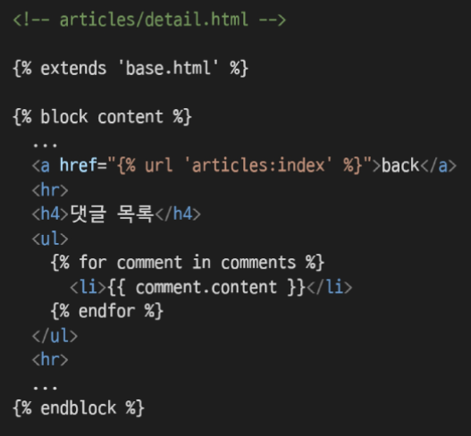

# Comment DELETE

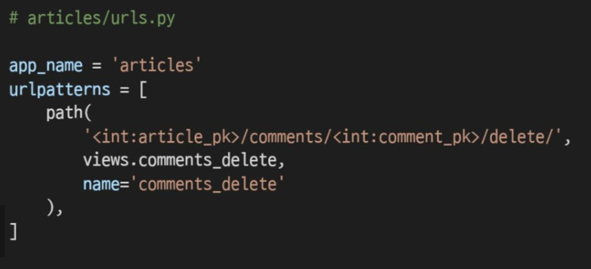

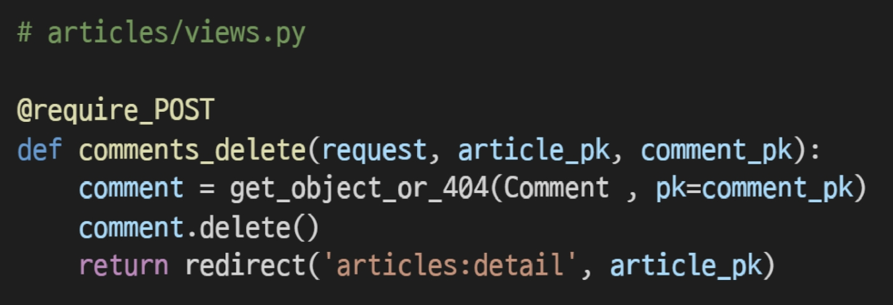

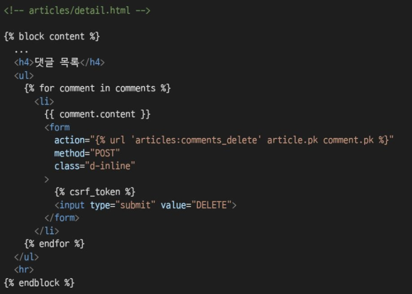

댓글 삭제 후 detail page에서 댓글 삭제 확인

## 인증된 사용자의 경우만 댓글 작성 및 삭제

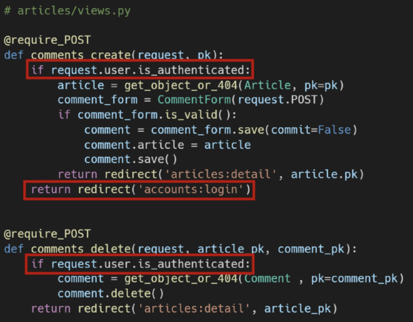

# Comment 추가 사항

## 댓글 개수 출력하기

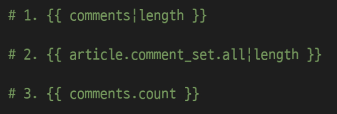

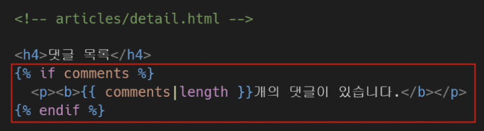

## 댓글이 없는 경우 대체 컨텐츠 출력 ( DTL 의 for - empty 태그 활용)

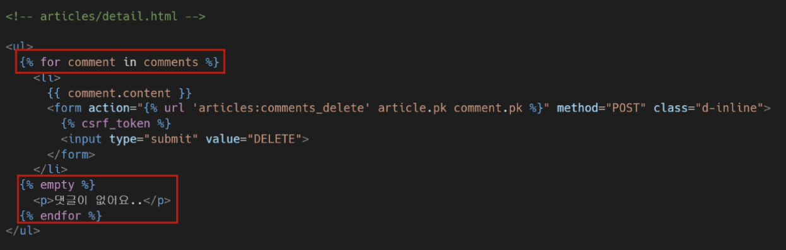

# Customizing authentication in Django

# Substituting a custom User model

## User 모델 대체하기 

- 일부 프로젝트에서는 Django의 내장 User 모델이 제공하는 인증 요구사항이 적절하지 않을 수 있음
    - ex) username 대신 email을 식별 토근으로 사용하는 것이 더 적합한 사이트

- Django는 User를 참조하는데 사용하는 AUTH_USER_MODEL 값을 제공하여, default user model을 재정의(override)할 수 있도록 함
- Django는 새 프로젝트를 시작하는 경우 기본 사용자 모델이 충분하더라도, 커스텀 유저 모델을 설정하는 것을 강력하게 권장 (highly recommended) 
    - 단, 프로젝트의 모든 migrations, 혹은 첫 migrate를 실행하기 전에 이 작업을 마쳐야 함.

## AUTH_USER_MODEL

- User를 나타내는데 사용하는 모델
- 프로젝트가 진행되는 동안 변경할 수 없음.
- 프로젝트 시작 시 설정하기 위한 것이며, 참조하는 모델은 첫 번째 마이그레이션에서 사용할 수 있어야 함
- 기본 값 : 'auth_User' (auth앱의 User 모델)
- [참고] 프로젝트 중간(mid -project)에 AUTH_USER_MODEL 변경하기
    - 모델 관계에 영향을 미치기 때문에 훨씬 더 어려운 작업이 필요
    - 즉, 중간 변경은 권장하지 않으므로 초기에 설정하는 것을 권장.

## Custom User 모델 정의하기

- 관리자 권한과 함께 완전한 기능을 갖춘 User 모델을 구현하는 기본 클래스인 AbstractUser를 상속받아 새로운 User 모델 작성

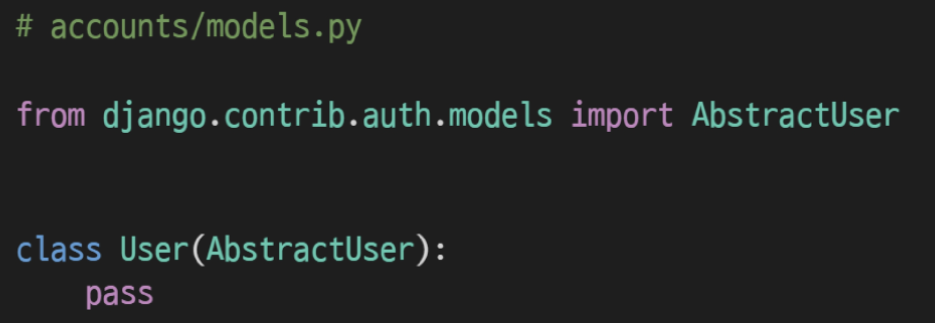

- 기존에 Django가 사용하는 User 모델이었던 auth앱의 User 모델을 accounts 앱의 User 모델을 사용하도록 변경

    ```python
    # settings.py
    AUTH_USER_MODEL = 'accounts.User'
    ```

    

- .admin site에 Custom User모델 등록

    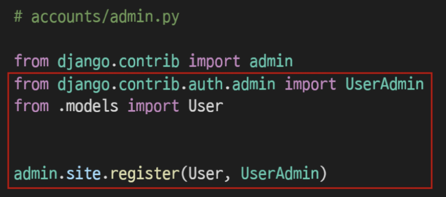

- 프로젝트 중간에 진행했기 때문에 데이터베이스를 초기화 한 후 마이그레이션 진행
- 초기화 방법
    1. db.sqlite3 파일 삭제
    2. migrations 파일 모두 삭제 (파일명에 숫자가 붙은 파일만 삭제)

# Custom user & Built- in auth forms

## 회원가입 시도 후 아래와 같은 에러 발생

- UserCreationForm과 UserChangeForm은 기존 내장 User 모델을 사용한 ModelForm이기 때문에 커스텀 User 모델로 대체해야함.

## Custom Built-in Auth Forms

- 기존 User모델을 사용하기 때문에 커스텀 User 모델로 다시 작성하거나 확장해야하는 forms.
    - UserCreationForm
    - UserChangeForm
- 이처럼 커스텀 User 모델이 AbstractUser의 하위 클래스인 경우 다음과 같은 방식으로 form을 확장

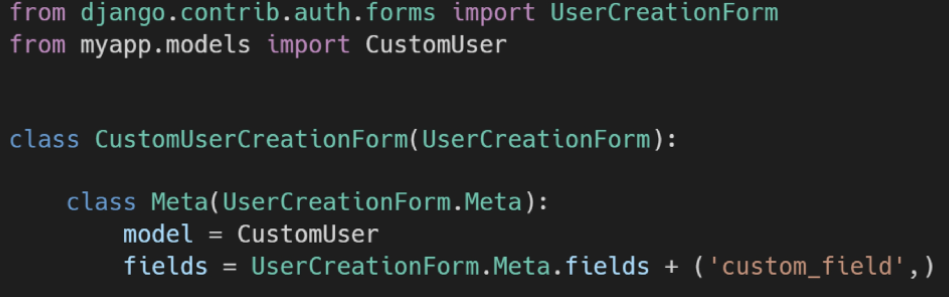

## UserCreationForm 확장

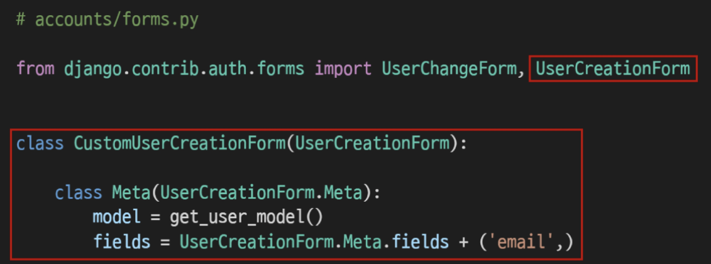

## signup view 함수 코드 수정

- 수정 후 회원가입 재시도
- 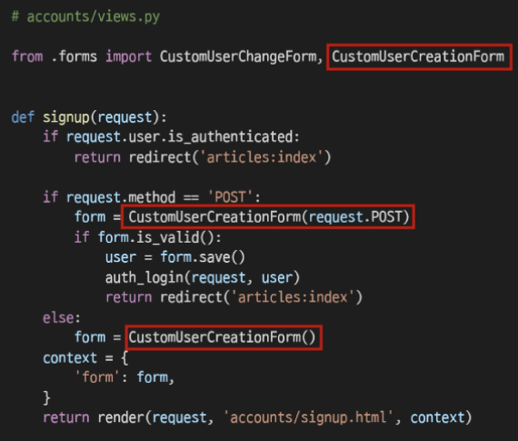

## get_user_model() 

- 현재 프로젝트에서 활성화 된 사용자 모델(active user model)을 반환
    - user 모델을 커스터마이징 한 상황에서는 Custom User 모델을 반환
- 이 때문에 Django는 User 클래스를 직접 참조하는 대신 django.contrib.auth.get_user_model()을 사용하여 참조해야 한다고 강조.

# Model Relationship 2

# User-Article ( 1: N ) 

## User 모델 참조하기 

1. **settings. AUTH_USER_MODEL**
    - User모델에 대한 외래 키 또는 다대다 관계를 정의 할 때 사용해야 함
    - models.py에서 User모델을 참조할 때 사용
2. **get_user_model()**
    - 현재 활성화(active)된 User 모델을 반환
        - 커스터마이징한 User모델이 있을 경우는 Custom User 모델, 그렇지 않으면 User를 반환
        - User를 직접 참조하지 않는 이유
    - models.py가 아닌 다른 모든 곳에서 유저 모델을 참조할 때 사용

## User와 Article 간 모델 관계 정의 후 migration

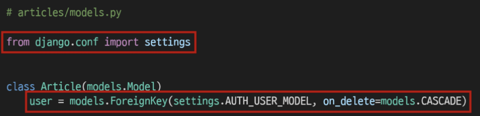

- null 값이 허용되지 않는 user_id 필드가 별도의 값 없이 article에 추가되려 하기 때문

    

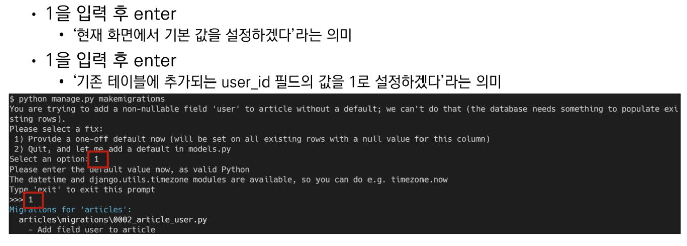

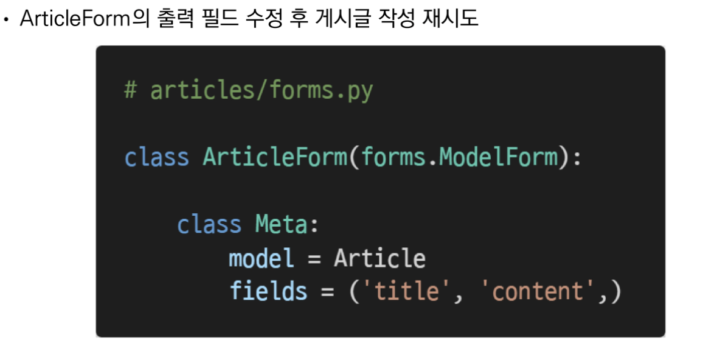


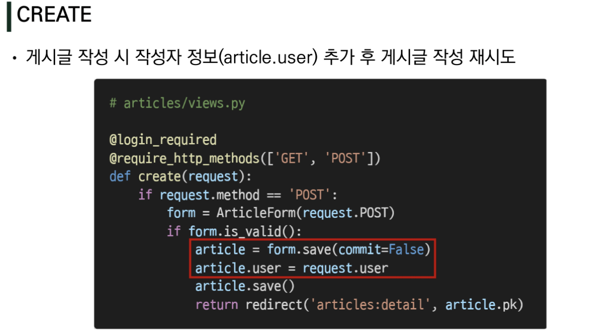

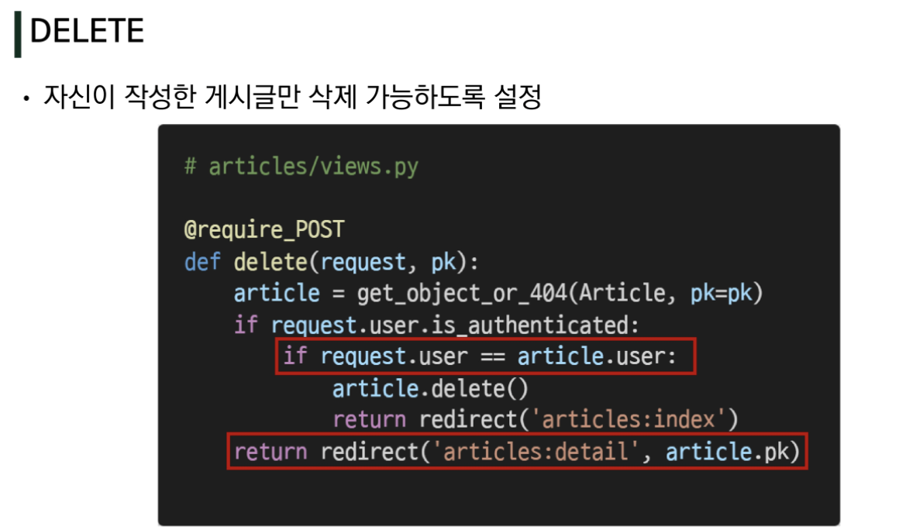

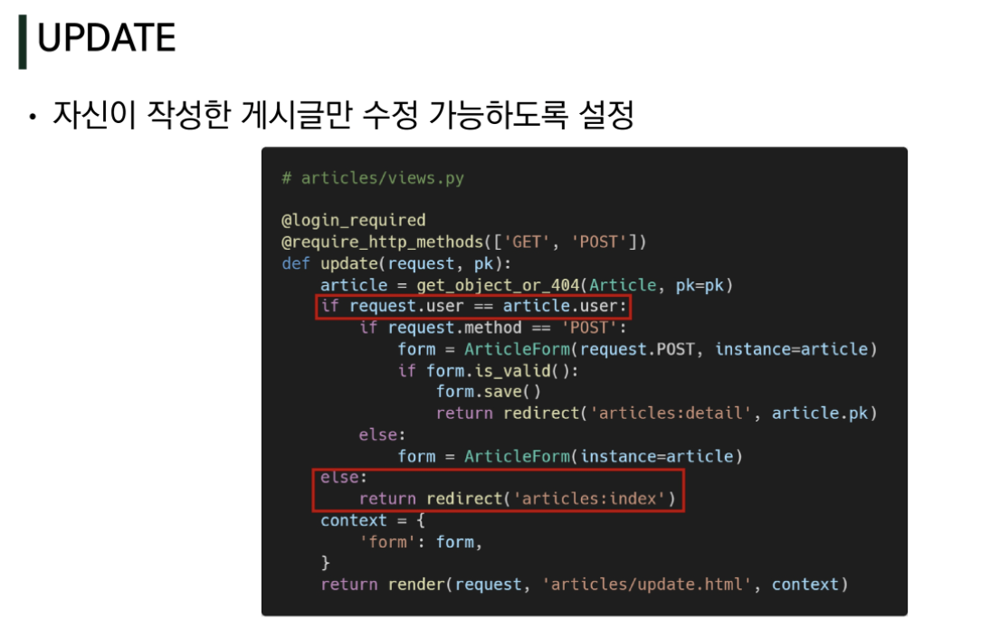

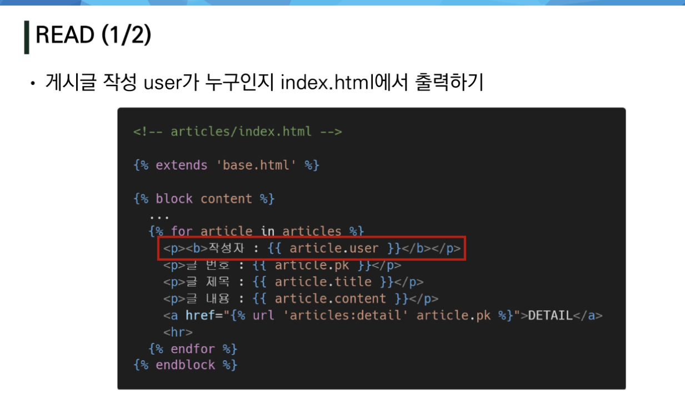

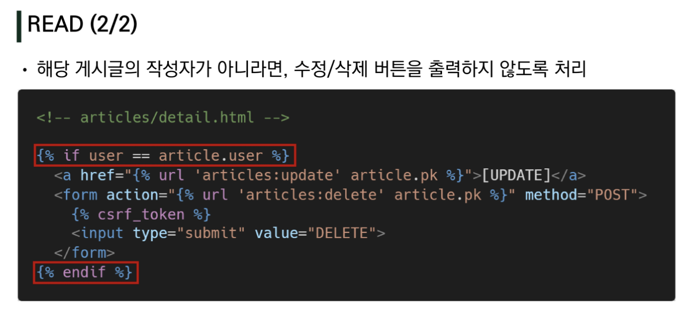

# User - Comment ( 1 : N )

## User 와 Comment 간 모델 관계 정의 후 migration

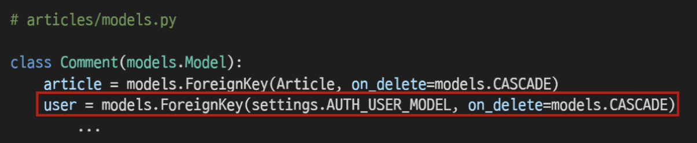

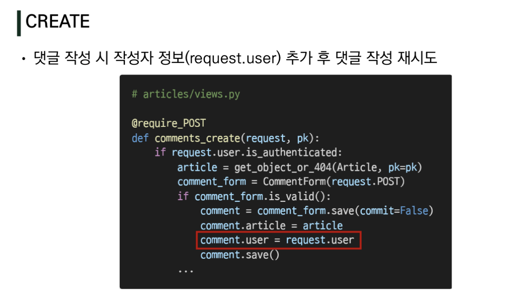

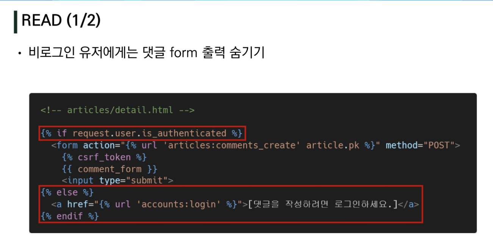

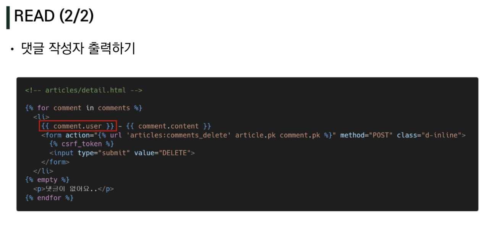

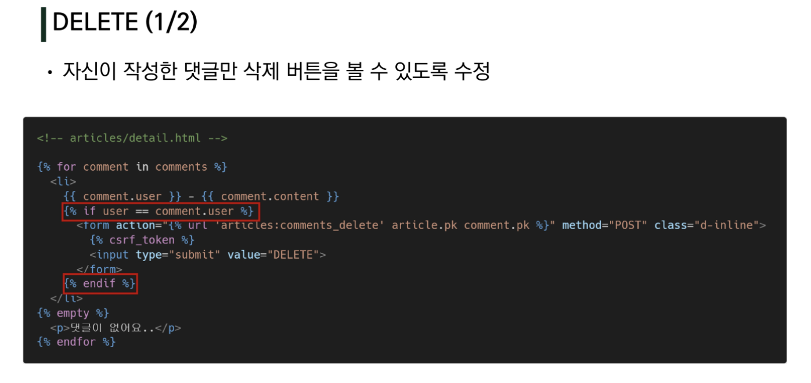

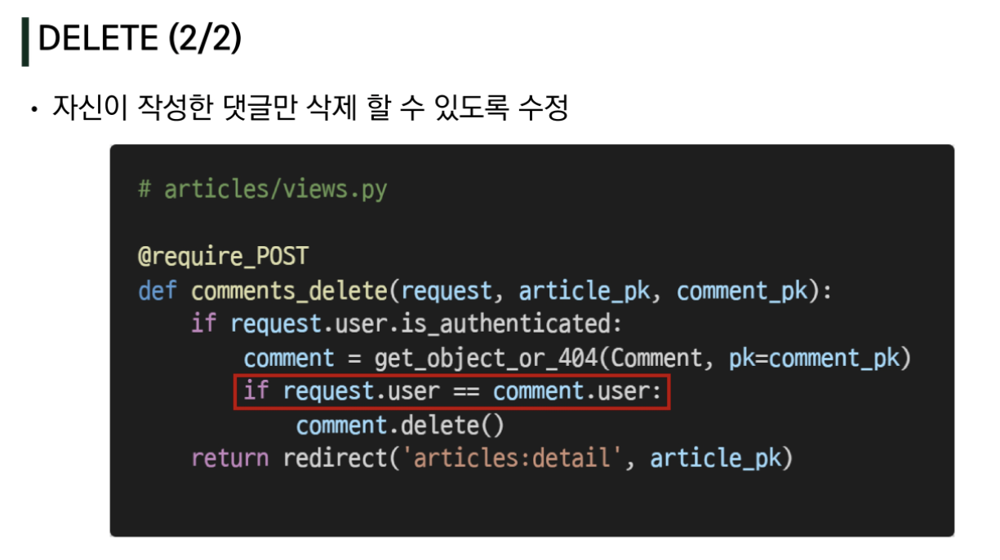